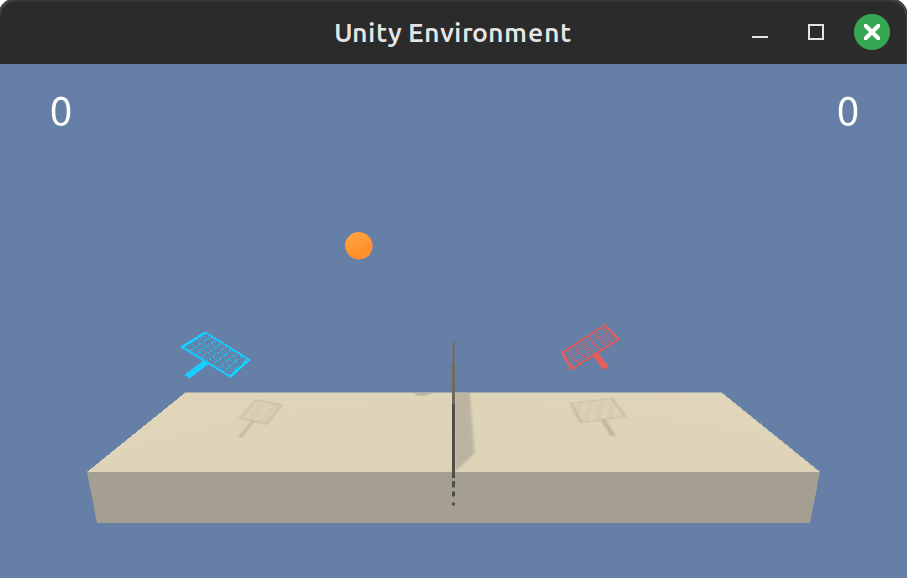

# Tennis MADDPG

Collaboration and competition project for the Udacity deep reinforcement learning nano-degree.

<div>
  
</div>

Video of the pretrained agent playing [here](https://drive.google.com/file/d/1APc40TphoOz9S-3qlgsOL2Hl1NVtX7c0/view?usp=sharing).

## Getting Started

The instructions below are intended only for Linux environments.

### Python Virtual Environment

[Install Anaconda](https://docs.anaconda.com/free/anaconda/install/linux/), create a new Python
`3.6` virtual environment, and activate it:

```bash
$> conda create --name drlnd python=3.6
$> conda activate drlnd
```

### Install Dependencies

Enter the `python` folder, and install the dependencies:

```bash
(drlnd) $> cd python
(drlnd) $> pip install .
```

Note that Udacity provides a custom setup of Unity ML-Agents. Some dependencies have been updated
updated from the Udacity repository because obsolete, notably PyTorch is at version `1.10.0`.

### Download the Unity Environment

Download and unzip the `Tennis` Unity environment in the `unity_env` folder (both the with and
without visualization). Follow the instructions in the `unity_env/README.md` file to do that.

### Additional Notes

The configuration used to run this code is Dell XPS-13-9310 with Linux Mint 21.2. MESA rendering
issues with Anaconda have been encountered (see [here](https://askubuntu.com/a/1405450), and
[here](https://stackoverflow.com/questions/71263856/kivy-not-working-mesa-loader-failed-to-open-iris-and-swrast)).
If the aforementioned instructions don't work, it is likely a custom environment issue that needs
to be troubleshooted ad-hoc.

## Instructions

To watch the pretrained MA-DDPG agent, run:

```bash
(drlnd) $> python tennis.py --simulation
```

You'll see first the scores plot, and then the Unity simulation once the plot window is closed.
The weights and scores of the pretrained agent are in the `multiagent_pretrained.pt` and the
`scores_pretrained.csv` files respectively.

To train a new agent instead, run:

```bash
(drlnd) $> python tennis.py --train
```

New files `scores.csv`, `multiagent_solved.pt`, `multiagent_best.pt` are created. Add a `_<NAME>`
suffix to run your simulation via:

```bash
(drlnd) $> python tennis.py --simulation=<NAME>
```

## Environment Details

Two agents control rackets to bounce a ball over a net. If an agent hits the ball over the net, it
receives a reward of `+0.1`. If an agent lets a ball hit the ground or hits the ball out of bounds,
it receives a reward of `-0.01`. Thus, the goal of each agent is to keep the ball in play.

The observation space consists of 8 variables corresponding to the position and velocity of the
ball and racket. Each agent receives its own, local observation. Two continuous actions are
available, corresponding to movement toward (or away from) the net, and jumping.

The task is episodic, and in order to solve the environment, the agents must get an average score
of `+0.5` (over 100 consecutive episodes, after taking the maximum over both agents). Specifically:

 * After each episode, add up the rewards that each agent received (without discounting), to get
   a score for each agent. This yields 2 (potentially different) scores. We then take the maximum
   of these 2 scores.
 * This yields a single score for each episode.

The environment is considered solved, when the average (over 100 episodes) of those scores is at
least `+0.5`.
